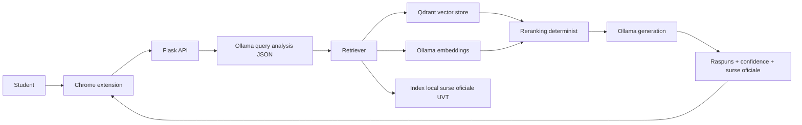

# Arhitectura tehnica UVT_Asist

UVT_Asist este o aplicatie RAG locala pentru intrebari studentesti despre informatii oficiale ale Universitatii de Vest din Timisoara. Interfata publica este extensia Chrome, iar backendul Flask orchestreaza cautarea in sursele oficiale indexate local, generarea raspunsului si returnarea surselor catre utilizator.

Aplicatia este proiectata local-first: indexul, embeddings, baza vectoriala si generarea raspunsului ruleaza pe calculatorul utilizatorului. Nu sunt folosite servicii externe AI in fluxul runtime.

## Diagrama pipeline



## Componente principale

### Extensia Chrome

Extensia Chrome este singura interfata destinata studentului. Popup-ul permite alegerea facultatii, trimiterea intrebarii catre backend si afisarea raspunsului, a surselor oficiale, a nivelului de incredere si a starii backendului.

Extensia comunica local cu Flask pe `http://127.0.0.1:5000`. Aceasta separare pastreaza UI-ul simplu si lasa procesarea RAG in backend.

### Backend Flask

Backendul Flask expune endpointurile publice:

- `GET /health`
- `GET /faculties`
- `GET /indexing/status`
- `POST /chat`
- `POST /feedback`

Rutele HTTP sunt subtiri si delega logica in servicii. Backendul valideaza inputul, decide facultatea efectiva, consulta indexul local, gestioneaza cache-ul de raspunsuri si construieste payloadul JSON pentru extensie.

### Crawler si indexare surse oficiale

Indexarea porneste de la sursele oficiale UVT si de la site-urile facultatilor configurate in `backend/faculties.py`. Crawlerul descarca pagini oficiale, extrage text din HTML si documente suportate, normalizeaza URL-urile si construieste un snapshot local in `backend/data/page_index.json`.

Scopul indexului JSON este sa ofere o reprezentare lizibila si reproductibila a surselor oficiale folosite in demo si evaluare.

### Chunking

Fiecare pagina este impartita in fragmente textuale. Fiecare chunk pastreaza metadate esentiale:

- `chunk_id`
- `faculty_id`
- `page_type`
- `title`
- `url`
- `chunk_text`
- `last_indexed`

Chunking-ul limiteaza dimensiunea fragmentelor si numarul de fragmente per pagina pentru a evita consumul excesiv de memorie si pentru a pastra contextul trimis catre model suficient de compact.

### Embeddings locale cu Ollama

Textul chunkurilor este transformat in embeddings prin modelul local configurat in Ollama, implicit `nomic-embed-text`. Intrebarile studentilor sunt embedate cu acelasi model, astfel incat cautarea semantica sa compare intrebarea cu fragmentele oficiale indexate.

Modelul de embedding este configurabil in `backend/.env`. Daca modelul se schimba, indexul vectorial trebuie reconstruit.

### Qdrant vector store

Qdrant stocheaza vectorii si metadatele chunkurilor. Backendul foloseste filtre pe `faculty_id` si `page_type` pentru a restrange cautarea la surse relevante pentru facultatea si intentia detectata.

Qdrant poate rula ca serviciu Docker local sau prin stocare locala Qdrant Client in dezvoltare. Pentru demo este preferat modul server, deoarece este mai usor de inspectat si resetat.

### Retrieval semantic

Fluxul de retrieval incepe cu normalizare tehnica minima: lowercase, eliminare diacritice pentru comparatii, compactare spatii si tokenizare. Corectarea semantica, reformularea intrebarilor, detectarea intentiei, cuvintele cheie si indiciul de facultate sunt cerute de la Ollama intr-un raspuns exclusiv JSON.

Backendul valideaza JSON-ul primit de la Ollama, dar nu ii permite modelului sa raspunda la intrebare sau sa aleaga surse. Daca Ollama nu raspunde sau JSON-ul nu este valid, sistemul continua cu intrebarea originala normalizata tehnic, cu `rewrite_source="raw_fallback"`, fara corectare semantica hardcodata.

Apoi backendul construieste una sau mai multe variante de query embedding folosind intrebarea corectata de Ollama, pastreaza termenii originali pentru semnale lexicale si cauta candidati in Qdrant.

Intentiile principale sunt:

- `orar`
- `contact`
- `burse`
- `admitere`
- `regulamente`
- `studenti`
- `general`

Pentru intrebari de politica, burse, cazare, acte justificative sau credite de voluntariat, sistemul prefera documente metodologice si pagini de regulament.

### Reranking determinist

Selectia finala a surselor nu este delegata modelului LLM. Candidatii semantici sunt rerankati determinist folosind semnale precum:

- potrivire lexicala intre intrebare si titlu, URL sau text;
- potrivire cu facultatea selectata;
- potrivire cu tipul paginii;
- URL-uri sau titluri specifice pentru orar, contact, admitere, burse, calendar academic;
- semnale speciale pentru regulamente si metodologii;
- penalizari pentru homepage-uri generice sau pagini vechi cand exista surse mai specifice.

Aceasta abordare reduce riscul ca modelul generativ sa aleaga surse gresite.

### Snapshot local al surselor

La runtime, backendul nu refetch-uieste paginile oficiale pentru fiecare intrebare. Sistemul trateaza indexul local JSON/Qdrant ca snapshot curent al documentelor oficiale.

Prospetimea informatiei este obtinuta prin reconstruirea indexului cu `python backend/build_index.py`, nu prin verificare live in timpul conversatiei. Aceasta decizie reduce latenta si face demo-ul mai predictibil.

### Generarea raspunsului cu Ollama

Dupa selectia surselor, backendul trimite catre modelul local Ollama doar fragmentele oficiale relevante. Promptul cere modelului sa raspunda in romana, sa citeze sursele oficiale si sa nu inventeze informatii care nu apar in context.

Pentru unele intrebari de navigare, backendul poate genera local un raspuns determinist care indica pagina oficiala, fara sa mai cheme modelul generativ.

### Confidence score si surse oficiale

Fiecare raspuns include:

- `confidence`: `low`, `medium` sau `high`;
- `confidence_score`: scor numeric;
- `confidence_reason`: explicatie scurta;
- `sources`: lista curata de surse oficiale;
- `evidence`: sumar despre numarul de surse si sursa principala.

Cand dovezile sunt slabe sau prea generale, sistemul trebuie sa spuna explicit acest lucru. In proiect, un raspuns cu incredere scazuta este preferabil unui raspuns fluent dar nesustinut.

## De ce ruleaza local

Aplicatia ruleaza local din trei motive principale:

1. Confidentialitate: intrebarile studentului nu sunt trimise catre servicii AI externe.
2. Control: sursele oficiale, modelele, indexul si rapoartele de evaluare pot fi inspectate si reproduse local.
3. Demo academic: comportamentul depinde de un stack local controlat, nu de disponibilitatea unui API extern.

Ollama ruleaza local pentru generare si embeddings, Qdrant ruleaza local pentru indexul vectorial, iar feedbackul este salvat local in `backend/feedback_log.jsonl`.

## Structura proiectului

```text
UVT_Asist/
|-- backend/
|   |-- app.py
|   |-- api/
|   |-- services/
|   |-- core/
|   |-- rag/
|   |   `-- ranking/
|   |-- scripts/
|   |-- tests/
|   |-- data/
|   |-- evaluation/
|   |-- build_index.py
|   |-- page_index.py
|   |-- vector_store.py
|   |-- vector_indexer.py
|   |-- ollama_client.py
|   `-- live_fetch.py
|-- extension/
|   |-- manifest.json
|   |-- popup.html
|   |-- popup.css
|   |-- popup.js
|   |-- options.html
|   |-- options.js
|   `-- js/
|       |-- content.js
|       |-- api.js
|       |-- storage.js
|       |-- state.js
|       `-- render.js
|-- docs/
|   |-- architecture.md
|   |-- development.md
|   |-- demo_checklist.md
|   `-- evaluation/
|-- scripts/
|-- docker-compose.yml
|-- requirements-dev.txt
`-- README.md
```

### Backend

`backend/app.py` este entrypoint-ul Flask. El creeaza aplicatia prin `create_app()`, configureaza CORS, inregistreaza blueprint-urile HTTP si pastreaza compatibilitatea cu rularea directa:

```powershell
python backend/app.py
```

`backend/api/` contine rutele HTTP publice: health, faculties, indexing status, chat si feedback. Rutele sunt intentionat subtiri: primesc requestul, apeleaza serviciul potrivit si returneaza JSON-ul.

`backend/services/` contine logica aplicatiei dintre rutele Flask si modulele tehnice: orchestrarea chatului, parsing, guard-uri, cache, feedback, health, indexing state, telemetry, fallback-uri locale si construirea raspunsului.

`backend/core/` centralizeaza configurarea runtime si loggingul backendului.

`backend/rag/` izoleaza logica de retrieval augmented generation: normalizare, analiza query-ului, detectarea intentului, retrieval orchestration si confidence scoring. `backend/rag/ranking/` contine semnalele deterministe de ranking: lexical, faculty, page type si policy/regulation.

`backend/scripts/` contine scripturi operationale pentru dezvoltare, demo si evaluare: reconstruire vectori, smoke retrieval, demo readiness, crawling si evaluari RAG/Q&A. `backend/tests/` contine testele pytest rapide, concepute sa nu depinda de Ollama, Qdrant sau internet.

### Extensia Chrome

`extension/` contine singura interfata publica a produsului. Extensia este incarcata in Chrome cu "Load unpacked" si comunica local cu backendul Flask.

Elementele principale sunt:

- `manifest.json`: configuratia Manifest V3;
- `popup.html`, `popup.css`, `popup.js`: markup-ul, stilurile si initializarea popup-ului;
- `options.html`, `options.js`: pagina pentru configurarea URL-ului backend;
- `extension/js/content.js`: textele vizibile in popup si lista fallback de facultati;
- `extension/js/api.js`: apelurile catre Flask;
- `extension/js/storage.js`: `chrome.storage.local`, URL backend, tema, istoric si intrebari recente;
- `extension/js/state.js`: state-ul conversatiei;
- `extension/js/render.js`: DOM pentru mesaje, surse, confidence, indexing state si feedback.

Extensia nu contine logica RAG. Ea trimite intrebarea catre backend si afiseaza raspunsul, sursele, confidence score si starea serviciilor.

### Documentatie si scripturi

`docs/` contine documentatia tehnica si academica: arhitectura, ghid de dezvoltare, checklist demo, asistenta AI si evaluare. Rapoartele brute generate local raman in `backend/data/evaluation/` si sunt ignorate de Git.

`scripts/` contine wrapper-e PowerShell pentru Windows: setup, pornire Qdrant, build index, backend, smoke checks, teste, cleanup si evaluare. Aceste scripturi nu inlocuiesc comenzile Python, ci reduc numarul de pasi manuali pentru demo si dezvoltare.

## Decizii de design

### Extensie Chrome ca interfata

Popup-ul extensiei Chrome este singura interfata destinata studentului. Alegerea pastreaza produsul aproape de scenariul real de utilizare: studentul poate deschide rapid asistentul fara o aplicatie web separata. Extensia ramane usoara, fara build system si fara framework frontend, iar logica RAG ramane in backend.

### Flask ca backend local

Flask este suficient pentru un backend local cu endpointuri publice stabile si responsabilitati clare. `backend/app.py` ramane subtire, iar logica de chat, feedback, health si indexing este delegata catre servicii.

### Ollama local pentru generatie si embeddings

Ollama a fost ales pentru a evita trimiterea intrebarilor catre servicii AI externe in runtime. Acelasi stack local furnizeaza modelul de generare, modelul de embeddings si analiza JSON a query-ului cand `OLLAMA_QUERY_ANALYSIS_ENABLED=true`.

Aceasta decizie ajuta demo-ul local si confidentialitatea, dar introduce latenta si dependenta de hardware-ul local.

### Qdrant pentru cautare vectoriala

Qdrant este folosit ca vector store local deoarece permite cautare semantica si payload filters pe metadate precum `faculty_id` si `page_type`. Payloadurile contin `chunk_id`, `faculty_id`, `page_type`, `title`, `url`, `chunk_text` si `last_indexed`.

Pentru demo este preferat Qdrant prin Docker Compose, deoarece colectia poate fi inspectata si resetata mai usor. Modul local `QDRANT_PATH` ramane util pentru dezvoltare fara Docker.

### RAG local-index-first

Runtime-ul raspunde din snapshotul local JSON/Qdrant. Prospetimea vine din reconstruirea indexului cu:

```powershell
python backend\build_index.py
```

Aceasta decizie face demo-ul mai predictibil si reduce dependenta de disponibilitatea site-urilor oficiale in timpul conversatiei. Costul este ca raspunsurile reflecta indexul local, deci indexul trebuie reconstruit cand sursele oficiale se schimba.

### Query analysis cu Ollama

Ollama poate produce o analiza JSON pentru intrebare: reformulare, intent, cuvinte cheie, indiciu de facultate si semnal de clarificare. Backendul valideaza schema si foloseste rezultatul doar pentru retrieval.

Modelul nu primeste dreptul sa aleaga sursele finale. Daca analiza JSON esueaza, sistemul continua cu intrebarea originala normalizata tehnic.

### Sursele finale nu sunt alese de LLM

Selectia surselor finale este facuta prin Qdrant retrieval si reranking determinist. Semnalele de ranking includ potriviri lexicale, facultate, tip de pagina, reguli pentru burse/regulamente si penalizari pentru homepage-uri generice.

Aceasta separare este importanta: modelul generativ poate formula raspunsul, dar nu decide ce URL-uri oficiale sunt folosite drept dovezi.

### Evaluatorul Q&A 1000 foloseste rubrica

Datasetul Q&A 1000 foloseste `ideal_answer` ca rubrica, nu ca raspuns unic. Nu se face comparatie text-la-text deoarece mai multe formulari pot fi corecte.

Scorul combina semnale verificabile: URL asteptat in Top-1/Top-3, page type, intent, required terms, forbidden terms si confidence. Pentru intrebari fara raspuns sigur, scorul recompenseaza refuzul prudent sau cererea de clarificare.
