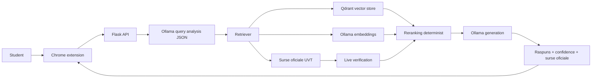

# Arhitectura tehnica UVT_Asist

UVT_Asist este o aplicatie RAG locala pentru intrebari studentesti despre informatii oficiale ale Universitatii de Vest din Timisoara. Interfata publica este extensia Chrome, iar backendul Flask orchestreaza cautarea in surse oficiale, verificarea, generarea raspunsului si returnarea surselor catre utilizator.

Aplicatia este proiectata local-first: indexul, embeddings, baza vectoriala si generarea raspunsului ruleaza pe calculatorul utilizatorului. Nu sunt folosite servicii externe AI in fluxul runtime.

## Diagrama pipeline

## Componente principale

### Extensia Chrome

Extensia Chrome este singura interfata destinata studentului. Popup-ul permite alegerea facultatii, trimiterea intrebarii catre backend si afisarea raspunsului, a surselor oficiale, a nivelului de incredere si a starii backendului.

Extensia comunica local cu Flask pe `http://127.0.0.1:5000`. Aceasta separare pastreaza UI-ul simplu si lasa procesarea RAG in backend.

### Backend Flask

Backendul Flask expune endpointurile publice:

- `GET /health`
- `GET /faculties`
- `GET /indexing/status`
- `POST /chat`
- `POST /feedback`

Rutele HTTP sunt subtiri si delega logica in servicii. Backendul valideaza inputul, decide facultatea efectiva, consulta indexul local, gestioneaza cache-ul de raspunsuri, aplica verificarea live cand este activata si construieste payloadul JSON pentru extensie.

### Crawler si indexare surse oficiale

Indexarea porneste de la sursele oficiale UVT si de la site-urile facultatilor configurate in `backend/faculties.py`. Crawlerul descarca pagini oficiale, extrage text din HTML si documente suportate, normalizeaza URL-urile si construieste un snapshot local in `backend/data/page_index.json`.

Scopul indexului JSON este sa ofere o reprezentare lizibila si reproductibila a surselor oficiale folosite in demo si evaluare.

### Chunking

Fiecare pagina este impartita in fragmente textuale. Fiecare chunk pastreaza metadate esentiale:

- `chunk_id`
- `faculty_id`
- `page_type`
- `title`
- `url`
- `chunk_text`
- `last_indexed`

Chunking-ul limiteaza dimensiunea fragmentelor si numarul de fragmente per pagina pentru a evita consumul excesiv de memorie si pentru a pastra contextul trimis catre model suficient de compact.

### Embeddings locale cu Ollama

Textul chunkurilor este transformat in embeddings prin modelul local configurat in Ollama, implicit `nomic-embed-text`. Intrebarile studentilor sunt embedate cu acelasi model, astfel incat cautarea semantica sa compare intrebarea cu fragmentele oficiale indexate.

Modelul de embedding este configurabil in `backend/.env`. Daca modelul se schimba, indexul vectorial trebuie reconstruit.

### Qdrant vector store

Qdrant stocheaza vectorii si metadatele chunkurilor. Backendul foloseste filtre pe `faculty_id` si `page_type` pentru a restrange cautarea la surse relevante pentru facultatea si intentia detectata.

Qdrant poate rula ca serviciu Docker local sau prin stocare locala Qdrant Client in dezvoltare. Pentru demo este preferat modul server, deoarece este mai usor de inspectat si resetat.

### Retrieval semantic

Fluxul de retrieval incepe cu normalizare tehnica minima: lowercase, eliminare diacritice pentru comparatii, compactare spatii si tokenizare. Corectarea semantica, reformularea intrebarilor, detectarea intentiei, cuvintele cheie si indiciul de facultate sunt cerute de la Ollama intr-un raspuns exclusiv JSON.

Backendul valideaza JSON-ul primit de la Ollama, dar nu ii permite modelului sa raspunda la intrebare sau sa aleaga surse. Daca Ollama nu raspunde sau JSON-ul nu este valid, sistemul continua cu intrebarea originala normalizata tehnic, cu `rewrite_source="raw_fallback"`, fara corectare semantica hardcodata.

Apoi backendul construieste una sau mai multe variante de query embedding folosind intrebarea corectata de Ollama, pastreaza termenii originali pentru semnale lexicale si cauta candidati in Qdrant.

Intentiile principale sunt:

- `orar`
- `contact`
- `burse`
- `admitere`
- `regulamente`
- `studenti`
- `general`

Pentru intrebari de politica, burse, cazare, acte justificative sau credite de voluntariat, sistemul prefera documente metodologice si pagini de regulament.

### Reranking determinist

Selectia finala a surselor nu este delegata modelului LLM. Candidatii semantici sunt rerankati determinist folosind semnale precum:

- potrivire lexicala intre intrebare si titlu, URL sau text;
- potrivire cu facultatea selectata;
- potrivire cu tipul paginii;
- URL-uri sau titluri specifice pentru orar, contact, admitere, burse, calendar academic;
- semnale speciale pentru regulamente si metodologii;
- penalizari pentru homepage-uri generice sau pagini vechi cand exista surse mai specifice.

Aceasta abordare reduce riscul ca modelul generativ sa aleaga surse gresite.

### Live verification

Live verification este o etapa ingusta de verificare a celor mai bune URL-uri oficiale selectate. Cand este activata, backendul refetch-uieste un numar mic de pagini oficiale si re-rankeaza fragmentele proaspete.

Aceasta etapa nu inlocuieste indexul local. Rolul ei este verificarea limitata a surselor de top, nu crawling general la runtime. Pentru demo offline, live verification poate fi dezactivata din `.env`.

### Generarea raspunsului cu Ollama

Dupa selectia surselor, backendul trimite catre modelul local Ollama doar fragmentele oficiale relevante. Promptul cere modelului sa raspunda in romana, sa citeze sursele oficiale si sa nu inventeze informatii care nu apar in context.

Pentru unele intrebari de navigare, backendul poate genera local un raspuns determinist care indica pagina oficiala, fara sa mai cheme modelul generativ.

### Confidence score si surse oficiale

Fiecare raspuns include:

- `confidence`: `low`, `medium` sau `high`;
- `confidence_score`: scor numeric;
- `confidence_reason`: explicatie scurta;
- `sources`: lista curata de surse oficiale;
- `evidence`: sumar despre numarul de surse, verificare live si sursa principala.

Cand dovezile sunt slabe sau prea generale, sistemul trebuie sa spuna explicit acest lucru. In proiect, un raspuns cu incredere scazuta este preferabil unui raspuns fluent dar nesustinut.

## De ce ruleaza local

Aplicatia ruleaza local din trei motive principale:

1. Confidentialitate: intrebarile studentului nu sunt trimise catre servicii AI externe.
2. Control: sursele oficiale, modelele, indexul si rapoartele de evaluare pot fi inspectate si reproduse local.
3. Demo academic: comportamentul depinde de un stack local controlat, nu de disponibilitatea unui API extern.

Ollama ruleaza local pentru generare si embeddings, Qdrant ruleaza local pentru indexul vectorial, iar feedbackul este salvat local in `backend/feedback_log.jsonl`.
