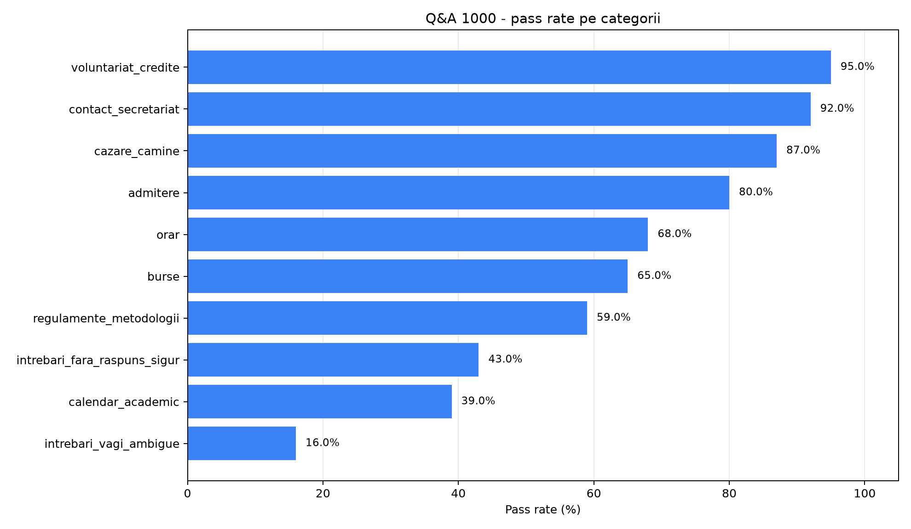
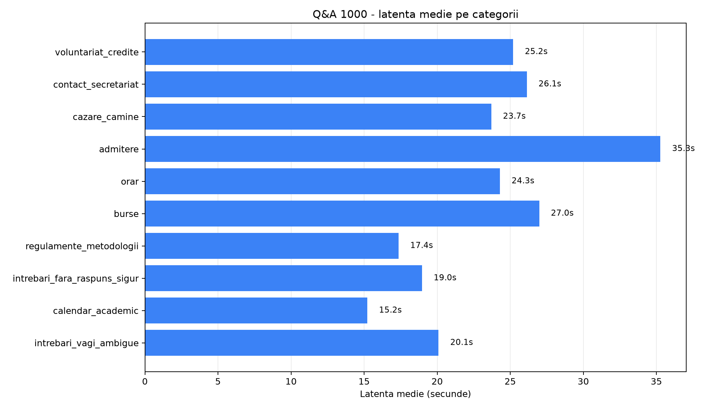
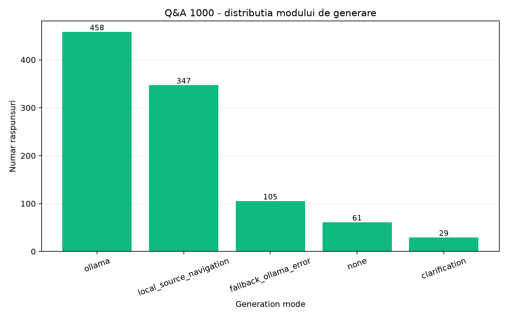
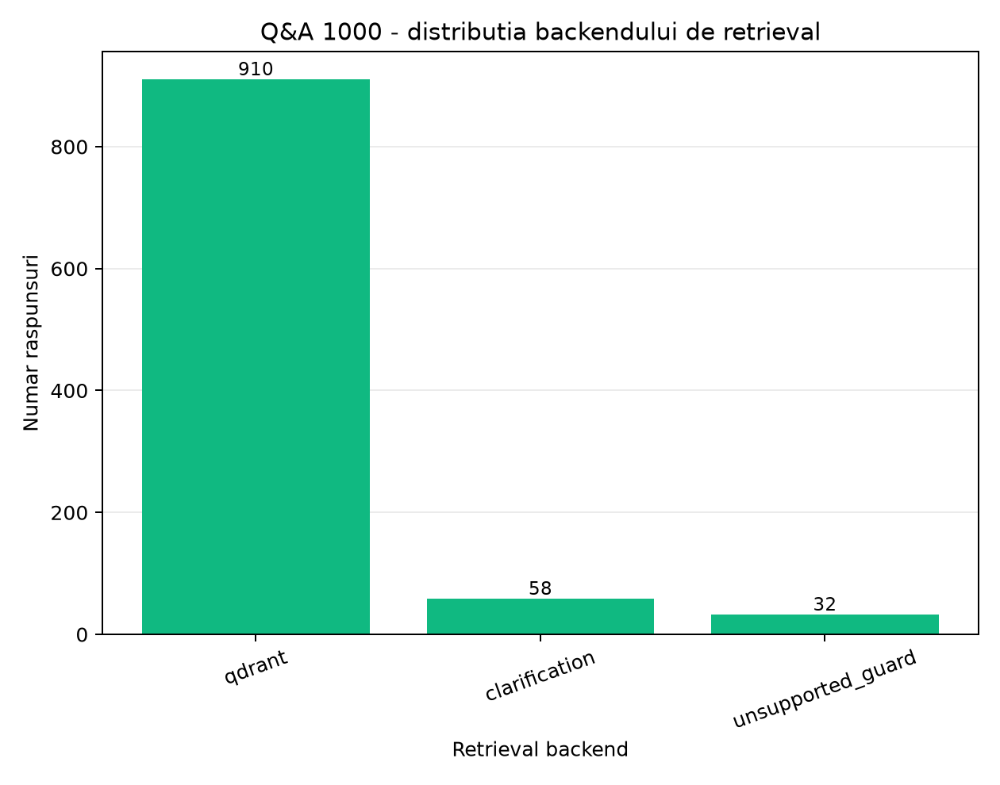

# Rezultate evaluare

Acest document pastreaza rezultatele stabile folosite in documentatie si in lucrarea de licenta. Rapoartele brute JSON/CSV/Markdown generate local raman in `backend/data/evaluation/` si sunt ignorate de Git.

## Q&A 1000 independent

Evaluarea independenta Q&A pe 1000 de intrebari a fost rulata pe stackul local UVT_Asist, prin endpointul public `POST /chat`, folosind datasetul `backend/evaluation/eval_qa_1000_independent.json`.

| Camp | Valoare |
| --- | --- |
| Dataset | `backend/evaluation/eval_qa_1000_independent.json` |
| Run label | `final_1000` |
| Backend URL | `http://127.0.0.1:5000` |
| Started at | `2026-06-25T13:16:19Z` |
| Finished at | `2026-06-26T16:12:08Z` |
| Total intrebari | 1000 |
| Categorii | 10 categorii x 100 intrebari |
| Scop | evaluare finala si raportare, nu tuning |

Datasetul contine intrebari independente generate in afara Codex. Fiecare item include `ideal_answer` ca rubrica, plus criterii de scoring precum `expected_url_contains`, `expected_confidence`, `required_terms`, `forbidden_terms`, intent si page type.

## Rezumat global Q&A 1000

| Metrica | Valoare |
| --- | ---: |
| Total intrebari | 1000 |
| Raspunsuri generate | 1000 |
| Passed | 644 |
| Failed | 356 |
| Pass rate | 64.4% |
| Scor mediu | 72.34 |
| Scor median | 82.35 |
| Overlap ideal mediu | 12.82 |
| Top-1 URL match | 439/694 (63.26%) |
| Top-3 URL match | 502/694 (72.33%) |
| Confidence match | 843/1000 (84.30%) |
| Erori | 0 |

Rezultatul de 64.4% inseamna ca 644 din cele 1000 de cazuri au depasit pragul de scor stabilit de evaluator. Scorul median mai mare decat media arata ca raspunsul tipic este mai bun decat media, dar exista categorii si cazuri cu scoruri mici care trag rezultatul global in jos.

Faptul ca au existat 0 erori indica stabilitate tehnica in rulare: backendul a returnat raspunsuri pentru toate cele 1000 de intrebari. Aceasta nu inseamna ca toate raspunsurile au fost corecte, ci ca fluxul aplicatiei nu a esuat la nivel de request.

## Rezultate Q&A 1000 pe categorii

| Categorie | Total | Pass rate | Scor mediu | Top-1 URL | Top-3 URL | Latenta medie | Erori |
| --- | ---: | ---: | ---: | ---: | ---: | ---: | ---: |
| admitere | 100 | 80.0% | 78.35 | 44/100 | 66/100 | 35.278s | 0 |
| burse | 100 | 65.0% | 78.29 | 92/100 | 93/100 | 26.984s | 0 |
| calendar_academic | 100 | 39.0% | 60.12 | 26/100 | 39/100 | 15.221s | 0 |
| cazare_camine | 100 | 87.0% | 84.70 | 91/100 | 92/100 | 23.703s | 0 |
| contact_secretariat | 100 | 92.0% | 89.36 | 46/54 | 46/54 | 26.135s | 0 |
| intrebari_fara_raspuns_sigur | 100 | 43.0% | 57.45 | 0/0 | 0/0 | 18.963s | 0 |
| intrebari_vagi_ambigue | 100 | 16.0% | 37.50 | 0/0 | 0/0 | 20.095s | 0 |
| orar | 100 | 68.0% | 74.76 | 24/40 | 24/40 | 24.294s | 0 |
| regulamente_metodologii | 100 | 59.0% | 72.57 | 19/100 | 42/100 | 17.358s | 0 |
| voluntariat_credite | 100 | 95.0% | 90.27 | 97/100 | 100/100 | 25.203s | 0 |

Cele mai bune categorii au fost `voluntariat_credite` (95%), `contact_secretariat` (92%), `cazare_camine` (87%) si `admitere` (80%). Acestea sunt categorii cu intentii administrative relativ clare si surse oficiale bine delimitate.

Cele mai slabe categorii au fost `intrebari_vagi_ambigue` (16%), `calendar_academic` (39%), `intrebari_fara_raspuns_sigur` (43%) si `regulamente_metodologii` (59%). Aceste rezultate arata limitele sistemului in clarificarea intrebarilor vagi, refuzul intrebarilor fara dovezi oficiale si selectia surselor foarte specifice pentru calendare, regulamente si metodologii.

## Distributii Q&A 1000

| Confidence | Numar |
| --- | ---: |
| high | 773 |
| medium | 118 |
| low | 109 |

| Retrieval backend | Numar |
| --- | ---: |
| qdrant | 910 |
| clarification | 58 |
| unsupported_guard | 32 |

| Generation mode | Numar |
| --- | ---: |
| ollama | 458 |
| local_source_navigation | 347 |
| fallback_ollama_error | 105 |
| none | 61 |
| clarification | 29 |

Faptul ca `qdrant` apare in 910 cazuri confirma ca evaluarea a folosit in principal fluxul local de retrieval vectorial. `local_source_navigation` arata ca o parte mare din intrebari au putut fi rezolvate determinist, prin directionarea catre sursa oficiala relevanta. `fallback_ollama_error` apare in 105 cazuri si trebuie analizat manual pentru a verifica daca fallback-ul a ramas util si corect.

## Latenta Q&A 1000

| Metrica | Secunde |
| --- | ---: |
| Medie | 23.323 |
| Mediana | 24.335 |
| P75 | 32.971 |
| P90 | 39.986 |
| P95 | 51.269 |
| Max | 149.611 |

Latenta este ridicata pentru o experienta conversationala rapida, dar este coerenta cu un stack local care foloseste Ollama pentru analiza/generare si Qdrant pentru retrieval. Valorile sunt specifice mediului local de test si depind de hardware, modelul Ollama, dimensiunea indexului si complexitatea documentelor recuperate.

Sursele principale de latenta sunt:

- embeddings locale pentru query;
- cautare Qdrant si eventuale cautari suplimentare filtrate;
- reranking determinist in Python;
- generare cu Ollama;
- fallback-uri locale cand generarea sau retrievalul nu ofera raspuns direct.

Practici pentru reducerea latentei:

- pastreaza Qdrant disponibil si indexul vectorial complet;
- reconstruieste indexul vectorial dupa schimbarea modelului de embedding;
- evita fallback-ul lexical complet pe indexuri foarte mari;
- foloseste raspuns determinist pentru intrebari de navigare cand sursa este clara;
- pastreaza contextul trimis catre Ollama compact si bazat pe cele mai bune fragmente oficiale.

## Grafice Q&A 1000

- [Pass rate pe categorii](figures/qa1000_pass_rate_by_category.png)
- [Latenta medie pe categorii](figures/qa1000_average_latency_by_category.png)
- [Distributia modului de generare](figures/qa1000_generation_mode_distribution.png)
- [Distributia backendului de retrieval](figures/qa1000_retrieval_backend_distribution.png)

## Evaluare RAG post-refactor

Aceasta rulare verifica traseul real folosit de extensia Chrome: Flask API, servicii, query analysis, Qdrant retrieval, reranking determinist si generare locala cu Ollama.

| Camp | Valoare |
| --- | --- |
| Data rularii | `2026-06-25` |
| Backend | `http://127.0.0.1:5000` |
| Dataset | `backend/evaluation/eval_qa_100.json` |
| Script | `backend/scripts/evaluate_rag.py` |
| Comanda | `python backend\scripts\evaluate_rag.py --questions backend/evaluation/eval_qa_100.json --timeout 180` |
| Model generare | `qwen3:4b` |
| Model embeddings | `nomic-embed-text` |
| Colectie Qdrant | `uvt_asist_chunks` |
| Retrieval mode | `qdrant-vector-rag` |

| Indicator | Valoare |
| --- | ---: |
| Intrebari evaluate | 100 |
| Raspunsuri primite | 100 |
| Erori de request | 0 |
| Confidence low | 21 |
| Top-1 URL match | 78 |
| Top-3 URL match | 78 |
| Intrebari fara raspuns sigur tratate corect | 10 |
| Latenta medie | 23.427s |
| Latenta mediana | 16.964s |

Evaluarea confirma ca aplicatia raspunde complet pe setul de 100 de intrebari in configuratia locala curenta, fara erori de request. Singurul miss URL ramas in sumarul rularii a fost `qa_calendar_006`, unde sistemul a cerut clarificarea facultatii pentru intrebarea `Unde vad saptamanile de cursuri si sesiune?`, cu `confidence=low` si fara surse.

## Comparatie Q&A 100 inainte/dupa optimizari

| Indicator | Inainte | Dupa | Diferenta |
| --- | ---: | ---: | ---: |
| Intrebari evaluate | 100 | 100 | 0 |
| Raspunsuri trecute | 65 | 100 | +35 |
| Rata de trecere | 65% | 100% | +35 pp |
| Raspunsuri esuate | 35 | 0 | -35 |
| Scor mediu Q&A | 69.54 | 85.84 | +16.30 |
| Scor median Q&A | 82.0 | 85.0 | +3.0 |
| Top-1 URL corect | 98/100 | 100/100 | +2 |
| Top-3 URL corect | 98/100 | 100/100 | +2 |
| Potrivire nivel incredere | 83/100 | 99/100 | +16 |
| Intrebari fara raspuns sigur tratate corect | 1/10 | 10/10 | +9 |
| Latenta medie | 27.182s | 13.679s | -13.503s |
| Latenta mediana | 37.689s | 4.342s | -33.347s |

Cele mai mari imbunatatiri au fost pe intrebari fara raspuns sigur, calendar academic, intrebari vagi si contact/secretariat. Imbunatatirile au venit din doua directii principale: selectie mai determinista a surselor oficiale si refuz/clarificare pentru intrebari personale, predictive sau prea vagi.

## Artefacte generate

Evaluatorii scriu rapoarte brute in `backend/data/evaluation/`:

- `eval_results_<timestamp>.json`
- `eval_results_<timestamp>.csv`
- `eval_summary_<timestamp>.md`
- `qa_eval_results_<timestamp>.json`
- `qa_eval_summary_<timestamp>.md`
- `qa1000_independent_results_<timestamp>.json`
- `qa1000_independent_summary_<timestamp>.md`

Aceste fisiere sunt generate local si nu trebuie versionate. Pentru lucrare se folosesc valorile stabile consolidate aici, graficele din `docs/evaluation/figures/` si tabelele din `docs/evaluation/qa1000_independent_latex_tables.tex`.

## Interpretare prudenta

Rezultatele sunt valabile pe seturile definite si pe configuratia locala folosita la rulare. Ele nu reprezinta garantie universala pentru orice intrebare posibila. Calitatea pentru intrebari noi depinde de existenta informatiei in sursele oficiale indexate, prospetimea indexului, disponibilitatea Ollama si Qdrant, calitatea extragerii textului si claritatea intrebarii.
